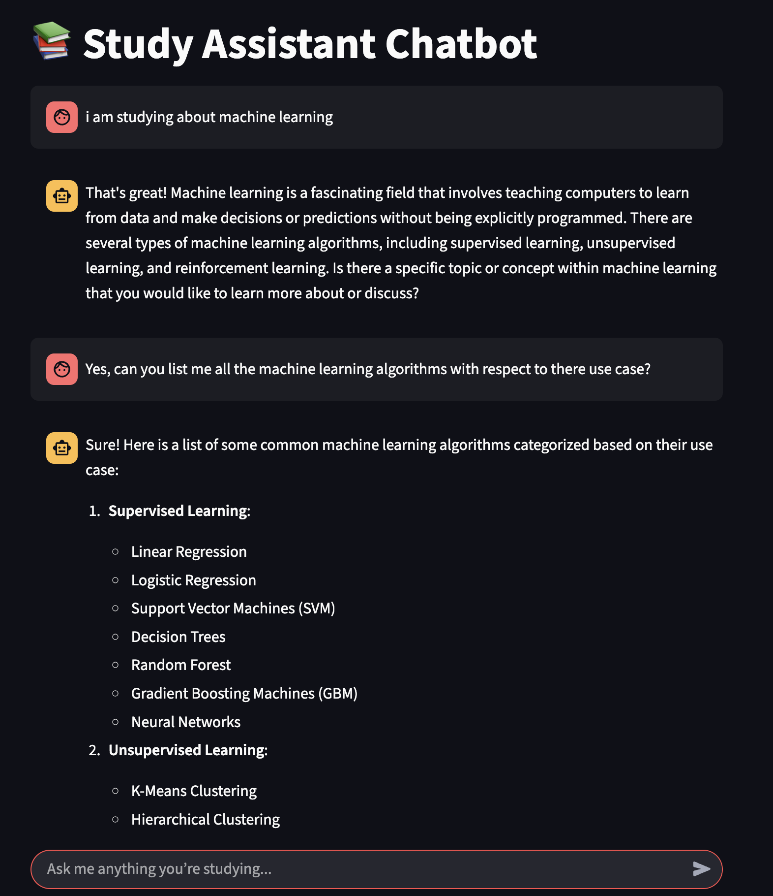

This Github had two parts of understanding based on Chat based prompts used in Langchain

# PART 1
## LangChain Prompt Playground — Research Summary Generator

This project is a simple, modular demonstration of how to use **LangChain's PromptTemplate system** to build LLM-powered applications.

It contains:

* A **static prompt generator** using `PromptTemplate`
* A **template JSON loader**
* A **Streamlit UI** where users select options, and an LLM summarizes a chosen research paper based on a structured prompt

---

## 📁 Folder Structure

```bash
.
├── prompt_generator.py     # Generates and saves the structured prompt as template.json
├── template.json           # Contains the saved static prompt template
├── prompts_ui.py           # Streamlit app using the prompt with ChatOpenAI
├── .env                    # Stores your OpenAI API key securely
```

---

## 🚀 Key Highlights

### 1. Modular Prompt Design (`prompt_generator.py`)

* Uses LangChain’s `PromptTemplate` to build a reusable, structured prompt with dynamic variables:

  * `paper_input`
  * `style_input`
  * `length_input`
* The prompt enforces consistent summarization logic including:

  * Mathematical explanations
  * Analogies
  * Controlled fallback for missing information
* Saves the prompt as a **JSON file** (`template.json`) using `.save()` for easy reuse.

### 2. Prompt Storage & Loading (`template.json` + `load_prompt`)

* The template is stored as a JSON file for decoupling logic from UI.
* In `prompts_ui.py`, we use `load_prompt('template.json')` to load the template and inject user input dynamically.

### 3. Interactive LLM App (`prompts_ui.py`)

* Built using **Streamlit** for simple UI interaction.
* Users select:

  * A research paper
  * Style of explanation (e.g., beginner-friendly, code-oriented)
  * Desired length
* On submission, the app:

  * Injects the inputs into the prompt
  * Sends it to **ChatOpenAI** (you can replace this with any `ChatModel`)
  * Displays the LLM-generated summary

---

## Example Prompt Logic (from `template.json`)

```txt
Please summarize the research paper titled "{paper_input}" with the following specifications:
Explanation Style: {style_input}
Explanation Length: {length_input}
1. Mathematical Details:
   - Include relevant mathematical equations if present.
   - Use simple code snippets where applicable.
2. Analogies:
   - Use relatable analogies to simplify ideas.

If certain information is missing, respond with: "Insufficient information available".
```

---

## .env Setup

Ensure you have an `.env` file in your root directory with your OpenAI API key:

```env
OPENAI_API_KEY=your_openai_key_here
```

---

## 🛠️ Installation & Run Instructions

```bash
# 1. Clone the repo
git clone https://github.com/your-username/langchain-prompts-research-summarizer.git
cd langchain-prompts-research-summarizer

# 2. Install dependencies
pip install -r requirements.txt

# 3. Add your .env file with OpenAI API key

# 4. Run the app
streamlit run prompts_ui.py
```

---

# PART 2

## Study Assistant Chatbot

!

An interactive, LLM-powered **AI tutor** built with **LangChain** and **Streamlit**, designed to help students explore and understand machine learning concepts (and beyond) in a conversational interface.

This chatbot remembers your questions and responds accordingly, mimicking a helpful and friendly tutor.

---

## Project Highlights

### 1. Conversational AI with Memory

* Retains conversation history using `st.session_state.chat_history`.
* Provides context-aware responses by feeding the full chat history to the model.

### 2. LangChain-Powered Prompt Engineering

* Uses `ChatPromptTemplate` to dynamically structure a **multi-turn, dynamic conversation**.
* Incorporates:

  * **SystemMessagePromptTemplate**: Defines the assistant’s persona (a helpful AI tutor).
  * **MessagesPlaceholder**: Injects chat history into the prompt automatically.
  * **HumanMessage / AIMessage**: Tracks conversation turns cleanly.

### 3. Clean Streamlit Interface

* Minimalist chat UI for real-time interaction.
* Custom message rendering for user and assistant messages.
* Smooth integration with LangChain models and prompt framework.

---

## Prompt Strategy Breakdown

LangChain’s prompt classes help structure conversations in a **flexible and scalable way**:

| Component                     | Description                                                           |
| ----------------------------- | --------------------------------------------------------------------- |
| `ChatPromptTemplate`          | Organizes multi-turn, dynamic chat prompts                            |
| `SystemMessagePromptTemplate` | Sets initial behavior: *“You are a helpful and friendly AI tutor...”* |
| `MessagesPlaceholder`         | Dynamically includes full message history (`history`)                 |
| `HumanMessage`, `AIMessage`   | Tracks user and assistant dialogue turns                              |

This design ensures the LLM responds **in context**, adapting its explanations based on the flow of conversation.

---

## 🧪 Example Flow

1. 🧑 User: "I'm studying machine learning."
2. 🤖 Assistant: Explains ML and asks a clarifying question.
3. 🧑 User: "Can you list ML algorithms by use case?"
4. 🤖 Assistant: Lists algorithms under supervised/unsupervised categories.

All previous exchanges are remembered and used to generate **coherent, helpful responses**.

---

## 🛠️ Installation & Usage

### 🧪 Setup

```bash
# Clone the repo
git clone https://github.com/your-username/study-assistant-chatbot.git
cd study-assistant-chatbot

# Install dependencies
pip install -r requirements.txt

# Add your OpenAI API key
echo "OPENAI_API_KEY=your_key_here" > .env

# Run the chatbot
streamlit run prac_chatbot.py
```

---

## 📂 File Overview

| File              | Description                          |
| ----------------- | ------------------------------------ |
| `prac_chatbot.py` | Main Streamlit app and chatbot logic |
| `.env`            | API key storage (not committed)      |

---

